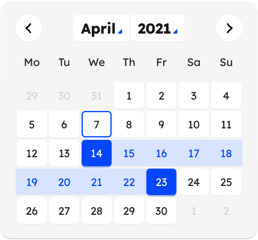

# Creating a Calendar Component

## Project Setup

- Use React, Typescript, vanilla-extract/css to create Calendar components
- Refer to the design file  but do not import the image.

## File Structure

- Name the component file `index.tsx`.
- Place the component file in the `src/CalendarMD` folder.
- Name the CSS file `index.css.ts`.

## Logic Structure

1. The calendar header should display the year and month.

   - Implement logic to navigate to the previous and next months when clicking the left and right arrow icons, respectively.
     - e.g., Moving from April to March should display the dates for March.

2. The date cell logic is as follows:

   - Display date cells in a maximum of 5 rows.
   - Dates should include the current month's dates, previous month's dates, and next month's dates, with the previous and next month's dates being displayed as disabled.
   - You can select two dates, which will be managed using `useState`.
   - Implement logic to change the color of all dates between the two selected dates.
     - e.g., Selecting the 14th and 21st should change the color of all dates between the 14th and 21st, and vice versa.

3. Add ARIA attributes:

   - Add `aria-label` to buttons.
   - Add `aria-selected` to selected dates.

4. Adhere to web standard tags:

   - Change elements with click events to `button` tags.

5. Add keyboard events:

   - The Tab key should move to the next focusable element.
   - When focused on a date, arrow keys should move to the corresponding date.
   - Pressing the up arrow key on the first row should move focus to the last row's focusable date.
   - Pressing the down arrow key on the last row should move focus to the first row's focusable date.
   - Pressing the left arrow key on the first column should move to the last column.
   - Pressing the right arrow key on the last column should move to the first column.
   - Pressing the left arrow key on the first day should move to the last day.
   - Pressing the right arrow key on the last day should move to the first day.

6. Date cell color information:

   - The first and last selected dates should have `backgroundColor: primary500, color: white`.
   - Dates between the first and last selected dates should have `backgroundColor: primary100, color: white`.
   - Disabled dates should have `backgroundColor: disabled, color: gray300`.
   - Other dates should have `backgroundColor: white, color: black`.

## CSS Setup

- Write styles using vanilla-extract/css according to the logic.
- Manage the palette colors as variables: `primary500: '#006879'`, `primary100: '#A9EDFF'`, `disabled: '#ddd'`, `gray300: '#aaa'`.

## Considerations

- Make logic not simple, but real-world
- Please use dayjs for the date-related library
- Ensure no type errors occur.
- Double-check that no logic is missing.
- Ensure the CSS closely resembles the design.
- Write all comments in Korean.
